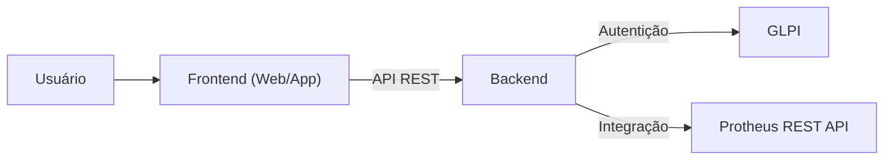

# Sistema de Solicitações V2

Recriação do sistema de solicitações ao Almoxarifado e ao Armazém. Aplicação de interface React criada com lovable e integração no backend com API's REST do Protheus e do GLPI.

