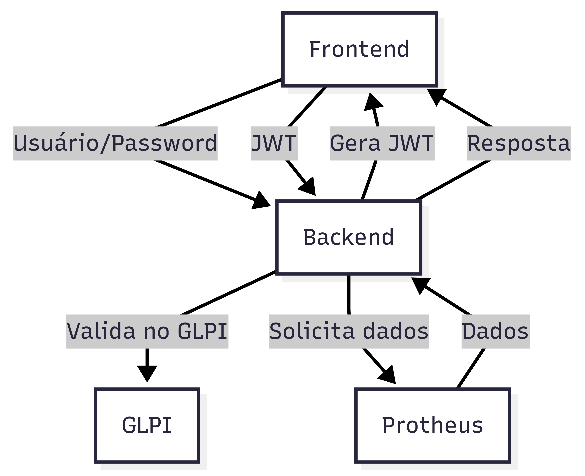

# Backend do Sistema de Solicitações

Este projeto implementa o backend de um sistema de solicitações, atuando como orquestrador entre o frontend, o sistema GLPI (para autenticação) e o Protheus (para dados de solicitações). Utiliza FastAPI e segue boas práticas de autenticação, segurança e integração de APIs.

## Sumário
- [Visão Geral](#visão-geral)
- [Arquitetura e Fluxos](#arquitetura-e-fluxos)
- [Principais Endpoints](#principais-endpoints)
- [Autenticação](#autenticação)
- [Variáveis de Ambiente](#variáveis-de-ambiente)
- [Dependências](#dependências)
- [Como rodar o projeto](#como-rodar-o-projeto)

---

## Visão Geral

- **Orquestrador**: Centraliza autenticação e repasse de solicitações.
- **Autenticação**: Usuário se autentica via GLPI; o backend gera um JWT próprio para uso interno.
- **Integração Protheus**: O backend utiliza um usuário único para autenticar e renovar tokens junto ao Protheus, repassando as solicitações do frontend.

## Arquitetura e Fluxos



- **GLPI**: Usado apenas para autenticação inicial do usuário.
- **JWT**: Após autenticação, o backend gera um JWT próprio, válido por tempo limitado (configurável).
- **Protheus**: O backend gerencia tokens Bearer do Protheus, renovando-os automaticamente quando necessário.

## Principais Endpoints

### Autenticação
- `POST /login` — Recebe usuário e senha, valida no GLPI e retorna um JWT próprio.
  - **Body:** `application/x-www-form-urlencoded` (OAuth2 padrão)
    - `username`, `password`
  - **Resposta:**
    ```json
    { "access_token": "...", "token_type": "bearer" }
    ```

### Solicitações de Compra
- `GET /requests/purchase` — Lista solicitações de compra do Protheus.
  - **Headers:** `Authorization: Bearer <token>` (JWT do backend)
  - **Query Params:**
    - `codSolicitacao`, `limit`, `offset`, `dataIni`, `dataFim`
  - **Resposta:** JSON conforme retorno do Protheus.

### (Exemplo) Warehouse
- `GET /requests/warehouse` — Estrutura pronta para endpoints de almoxarifado (em desenvolvimento).

## Autenticação e Segurança

- **GLPI**: O backend faz login no GLPI usando HTTP Basic Auth, obtém um session_token e encerra a sessão imediatamente após a validação.
- **JWT**: O backend gera um JWT próprio, contendo informações do usuário, com expiração configurável (padrão: 15 minutos).
- **Protheus**: O backend gerencia tokens Bearer do Protheus, renovando automaticamente ao receber 401.
- **Proteção de rotas**: Endpoints sensíveis exigem JWT válido.

## Variáveis de Ambiente

O backend depende das variáveis de ambiente exemplo em [`.env.example`](app/.env.example)

## Dependências

Principais bibliotecas utilizadas (ver `requirements.txt` para lista completa):
- fastapi
- httpx
- python-jose
- python-dotenv
- uvicorn
- pydantic

## Como rodar o projeto

1. Instale as dependências:
   ```bash
   pip install -r requirements.txt
   ```
2. Configure o arquivo `.env` com as variáveis necessárias.
3. Inicie o backend:
   ```bash
   uvicorn app.main:app --reload
   ```

---

## Observações
- O backend não armazena senhas de usuários, apenas valida via GLPI.
- O JWT gerado pelo backend deve ser enviado em todas as requisições protegidas.
- O sistema está preparado para expansão de endpoints (ex: warehouse, novos tipos de solicitações).

---

### Estrutura de Pastas

```
backend/
  app/
    jwt.py              # Geração e validação de JWT
    login/              # Lógica de autenticação GLPI
      login.py
    main.py             # Inicialização FastAPI e routers
    protheus_auth.py    # Gerenciamento de tokens Protheus
    requests/
      purchase/         # Endpoints de solicitações de compra
        routes.py
      warehouse/        # Endpoints de almoxarifado (em desenvolvimento)
        routes.py
    schemas.py          # Schemas Pydantic
  requirements.txt      # Dependências
```